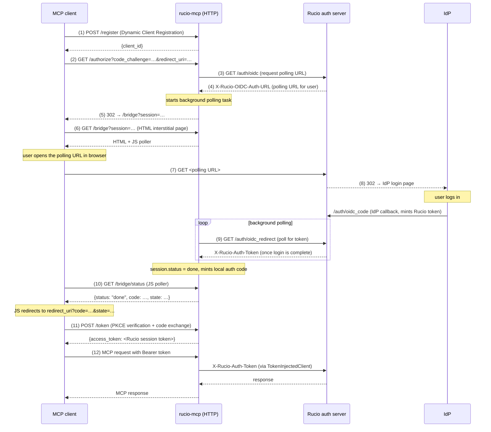

# Rucio OAuth Bridge Architecture

rucio-mcp's HTTP transport bridges two incompatible auth worlds:

- **MCP clients** (Claude Desktop, VS Code) speak standard OAuth 2.1 —
  auth-code+PKCE+S256, Dynamic Client Registration (RFC 7591), and bearer tokens
- **Rucio** uses a custom OIDC polling flow: the Rucio server acts as the IdP's
  OAuth client; users never receive raw IdP JWTs — they get Rucio session tokens
  delivered via a server-side polling endpoint

rucio-mcp bridges these by acting as an OAuth 2.1 Authorization Server that
internally drives the Rucio OIDC flow, then returns the resulting Rucio session
token as the MCP `access_token`.

---

## Sequence diagram

---

## Key design decisions

### Token passthrough

The MCP `access_token` **is** the Rucio session token verbatim. rucio-mcp does
not wrap it, sign it, or store it beyond the in-flight session window.
`load_access_token()` in `RucioBridgeProvider` returns a synthetic `AccessToken`
with no validation — Rucio itself rejects stale or invalid tokens with 401,
which surfaces as a `CannotAuthenticate` exception in the tool, triggering the
MCP client to re-run the OAuth flow.

### Why server-side polling (not webhome cookie or fetchcode)

Rucio supports three ways to deliver session tokens after IdP login:

| Method                                | Why it fails for rucio-mcp                                                                                                                                   |
| ------------------------------------- | ------------------------------------------------------------------------------------------------------------------------------------------------------------ |
| `webhome` cookie                      | `Domain` is derived from the `webhome` URL; cross-domain deployments (e.g. `rucio-mcp.af.uchicago.edu` ↔ `vre-rucio-auth.cern.ch`) cannot receive the cookie |
| `fetchcode`                           | Requires the user to manually copy a code from the browser into a form — worse UX than native PKCE                                                           |
| `oidc_auto` (resource-owner-password) | Explicitly discouraged; requires credentials in rucio-mcp                                                                                                    |

Server-side polling (`X-Rucio-Client-Authorize-Polling: True`) is the only
approach that works cross-domain and requires no user action beyond logging in.
See [rucio/rucio#8568](https://github.com/rucio/rucio/discussions/8568) for the
upstream discussion on this flow.

### In-memory state only

`BridgeStateStore` holds in-flight sessions in memory with a 5-minute TTL
(matching Rucio's `OAuthRequest.expired_at`). After the MCP client exchanges the
auth code for a token, the session is no longer needed. DCR clients are also
in-memory — MCP clients re-register after a server restart.

### No IAM registration required

The Rucio auth server acts as the IdP's OAuth client. rucio-mcp never registers
with ATLAS IAM, ESCAPE IAM, or any other IdP. All that's needed on the rucio-mcp
side is a `rucio.cfg` with the `[client]` OIDC settings that the Rucio CLI
already uses.

---

## Code map

| Component                            | File                        | Responsibility                                                             |
| ------------------------------------ | --------------------------- | -------------------------------------------------------------------------- |
| `RucioCfg`                           | `auth/rucio_cfg.py`         | Read OIDC config from `rucio.cfg` `[client]`                               |
| `RucioOidcPoller`                    | `auth/rucio_oidc_poller.py` | Async `request_auth_url()` + `poll_for_token()` via httpx                  |
| `BridgeSession` / `BridgeStateStore` | `auth/bridge_state.py`      | Thread-safe in-memory session state with TTL                               |
| `RucioBridgeProvider`                | `auth/bridge_provider.py`   | `OAuthAuthorizationServerProvider` — DCR, authorize, token exchange        |
| `register_bridge_routes`             | `auth/bridge_routes.py`     | `GET /bridge` (HTML) + `GET /bridge/status` (JSON)                         |
| `BearerTokenClientFactory`           | `auth/factory.py`           | Extract bearer from request, build `TokenInjectedClient`, cache by session |
| `TokenInjectedClient`                | `auth/token_client.py`      | Inject Rucio session token into `rucio.client.Client` auth hooks           |
